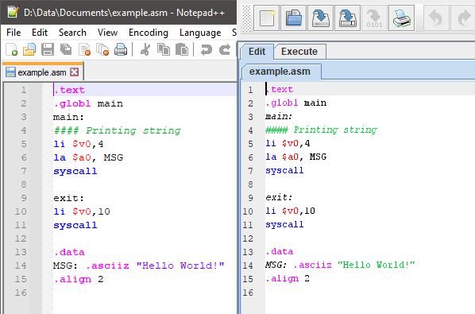

# Notepad++ MIPS Syntax Highlighting
MIPS Assembly Notepad++ syntax highlighting, based on the [MARS (MIPS Assembly 
and  Runtime Simulator)](http://courses.missouristate.edu/KenVollmar/MARS/index.htm)
 colors.

  

The differences I'm currently aware of:

1. Labels are not _italicized_ in N++. This is because I couldn't figure out 
how to do it [with UDL](https://ivan-radic.github.io/udl-documentation/), and
it doesn't bother me too much.
2. Strings wrapped in "" and '' are **purple** in N++ instead of **green.** 
This was a conscious choice, as comments being an exclusive color is
desirable. There's probably a better option than purple, but that's 
just what made sense in the moment.

# Installation Instructions
1. Go to the [releases](https://github.com/marshallpt/notepad-plus-plus_mips/releases)
 and download the latest `mips-mars-style.xml`, or clone the repo.
1. In Notepad++: from the title bar, go to **Language -> User Defined Language -> 
Define your language -> Import**
1. Navigate to wherever you downloaded `mips-mars-style.xml` and select it.

If you got "Import Successful", congratulations! You can now close the **User 
Defined Language** window, and **MIPS (MARS style)** will be an option in your
 **Language** dropdown, and will automatically be selected for `.asm` and `.s`
  files.
